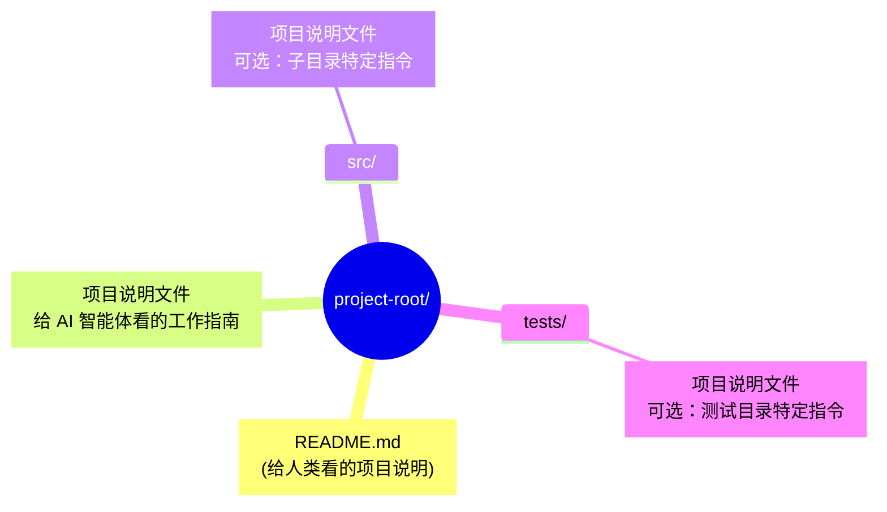
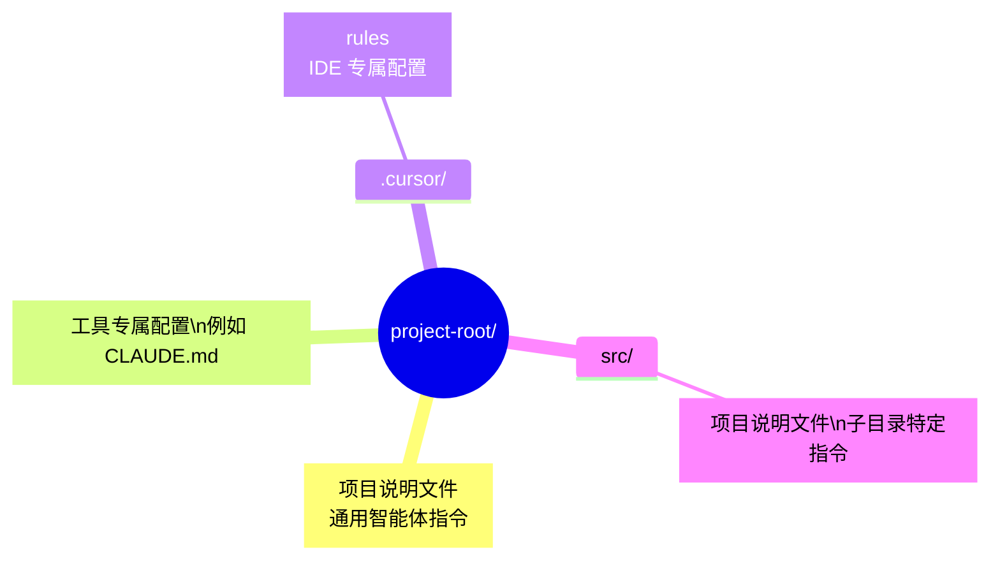

## 12.3 项目说明文件规范指南

“项目说明文件”是一类面向 AI 编程智能体的项目级说明文档，用于集中存放构建命令、测试入口、代码风格、安全边界等关键信息。不同工具生态可能使用不同文件名，但目标一致：为智能体提供稳定、可预测的“项目操作手册”。

### 12.3.1 什么是项目说明文件

项目说明文件是面向 AI 编程智能体的项目级操作手册，重点回答“能做什么、如何做、不能做什么”。

### 12.3.2 核心概念

如果说 `README.md` 是给人类开发者看的项目说明，那么项目说明文件就是给 AI 编程智能体看的“机器可读说明书”。

> **类比**：  
> - `README.md` → 人类开发者的项目介绍  
> - 项目说明文件 → AI 编程智能体的工作指南

### 12.3.3 为什么需要项目说明文件

传统的 README.md 存在以下问题：

1. **面向人类**：包含快速入门、项目描述等人类易读但机器难以精确解析的内容
2. **信息分散**：构建命令、测试规则、代码风格等信息可能散落在多个文件中
3. **格式不统一**：每个项目的写法不同，Agent 需要“猜测”

项目说明文件通过标准化格式解决这些问题：

- 给智能体一个 **清晰、可预测** 的指令位置
- 提供 **精确、步骤化** 的操作指南
- 保持 README 简洁，专注人类读者

### 12.3.4 文件结构

文件结构通常由根目录主文件、子目录补充文件和可按需引用的扩展文档索引组成。

### 12.3.5 基本布局



图 12-2：项目说明文件布局结构

### 12.3.6 嵌套规则

- 根目录的说明文件适用于整个项目
- 子目录的说明文件可以覆盖或补充父目录的指令
- 适用于 Monorepo 等大型项目

### 12.3.7 推荐内容结构

一个完整的项目说明文件通常包含以下部分：

### 12.3.8 项目概述

````markdown
# Project Overview

This is a TypeScript-based web application using Next.js 14.
Architecture: Monorepo with apps/ and packages/ directories.
````

### 12.3.9 构建与测试命令

```markdown
# Build & Test

###  Build

npm run build

###  Test

npm run test              # 运行所有测试
npm run test:unit         # 仅单元测试
npm run test:e2e          # 端到端测试

###  Lint

npm run lint              # ESLint + Prettier
```

### 12.3.10 代码风格指南

```markdown
# Code Style

- Use TypeScript strict mode
- Prefer functional components over class components
- Use named exports, avoid default exports
- Maximum line length: 100 characters
- Use `const` by default, `let` only when necessary
```

### 12.3.11 测试规范

```markdown
# Testing Guidelines

- All new features must have unit tests
- Test files should be co-located: `foo.ts` → `foo.test.ts`
- Use `describe` for grouping, `it` for individual tests
- Mock external APIs in tests
```

### 12.3.12 安全考虑

```markdown
# Security

- Never commit secrets or API keys
- Use environment variables for configuration
- Validate all user input
- Avoid `eval()` and `dangerouslySetInnerHTML`
```

### 12.3.13 Pull Request 指南

```markdown
# Pull Request Guidelines

- Keep PRs focused and small (< 500 lines changed)
- Write meaningful commit messages
- Include tests for new functionality
- Update documentation if needed
```

### 12.3.14 完整示例

````markdown
# 项目说明文件（示例）

###  Project Overview

A Python REST API.
- Framework: <web-framework>
- Database: <database>
- Authentication: <auth>

###  Environment Setup


```bash
python -m venv venv
source venv/bin/activate
pip install -r requirements.txt
cp .env.example .env
```

###  Build & Run


```bash
# Development

uvicorn app.main:app --reload

# Production

uvicorn app.main:app --host 0.0.0.0 --port 8000
```

###  Test Commands


```bash
# Run all tests

pytest

# Run with coverage

pytest --cov=app --cov-report=html

# Run specific test file

pytest tests/test_users.py
```

###  Code Style

- Follow PEP 8
- Use type hints for all function parameters and returns
- Docstrings in Google style
- Max line length: 88 (Black formatter)

###  File Naming

- API routes: `app/routers/{resource}.py`
- Models: `app/models/{entity}.py`
- Schemas: `app/schemas/{entity}.py`
- Tests: `tests/test_{module}.py`

###  Security

- Validate all input with Pydantic models
- Use parameterized queries (SQLAlchemy handles this)
- Never log passwords or tokens
- Rate limit all public endpoints
````

### 12.3.15 工具支持

不同工具生态对项目说明文件的支持程度不同：有的会自动加载指定文件名，有的需要在配置中声明路径。建议以“文件内容结构”作为稳定部分，以“文件名与加载方式”作为可替换的适配层。

### 12.3.16 与其他配置文件的关系

项目说明文件旨在 **统一** 而非取代现有的工具特定配置：

| 工具 | 专用配置 | 项目说明文件的作用 |
|------|----------|-----------------|
| IDE / 编辑器插件 | 项目内规则目录 | 提供通用指令 |
| CLI 智能体 | 项目内配置文件 | 提供通用指令 |
| 自动化机器人 | CI 配置 | 提供项目上下文 |

**最佳实践**：将通用指令放在项目说明文件中，将工具特定配置放在各自文件中。

### 12.3.17 高级技巧：渐进式披露

不要试图把所有信息都塞进一个项目说明文件。这会消耗 **词元** 并降低智能体的注意力。**推荐结构**：
```
agent_docs/
  ├── architecture.md
  ├── testing_guide.md
  └── database_schema.md
项目说明文件（只包含索引和指针）
```

在项目说明文件中：
> “关于数据库设计细节，请阅读 `agent_docs/database_schema.md`。”

智能体会在需要时自行读取子文档，而不是每次都背负所有知识。

### 12.3.18 核心原则：What / Why / How

一个好的配置文件应该回答三个问题：
1. **WHAT**: 技术栈、项目结构（Monorepo 里的各部分职责）。
2. **WHY**: 设计决策的背景（为什么这么设计？历史包袱是什么？）。
3. **HOW**: 如何运行、测试、验证。

### 12.3.19 反模式：不要做 Linter 的工作

❌ **错误做法**：在 **提示词 (Prompt)** 中写几百行的代码风格指南（空格还是 Tab、大括号换行）。
* **后果**：浪费 Token，Agent 记不住，且执行不稳定。

✅ **正确做法**：使用 ESLint / Prettier / Ruff。
*   让工具自动修复格式与 Lint 错误。
*   智能体只需要知道 "run `npm run lint:fix` before commit"。

### 12.3.20 采用建议

采用时建议先建立最小可用版本，优先覆盖构建命令、测试入口和安全边界，再逐步扩展细则。

### 12.3.21 快速开始

1. 在项目根目录创建项目说明文件
2. 复制上面的模板并根据项目调整
3. 重点填写 **构建命令**和**代码风格** 部分

### 12.3.22 逐步完善

- 第一周：基础构建和测试命令
- 第二周：代码风格和命名规范
- 第三周：安全规则和 PR 指南
- 持续：根据智能体表现调整和补充

### 12.3.23 验证效果

使用 AI 编程 Agent 进行以下测试：

1. “请添加一个新的 API 端点”——检查是否遵循文件命名规范
2. “请为这个函数添加测试”——检查测试是否放在正确位置
3. “请修复这个 bug”——检查是否运行了测试套件

### 12.3.24 相关资源

建议查阅你所使用工具的官方文档，确认其支持的文件名、加载顺序与覆盖规则。

---

### 12.3.25 与其他配置文件的对比

不同工具可能采用不同的“项目配置文件”，与项目说明文件在定位上类似但范围不同。

#### 对比表

| 维度 | 项目说明文件 | 工具专属配置文件 |
|------|-----------|-----------|
| 标准化 | 目标是跨工具通用 | 工具专属 |
| 适用范围 | 尽量跨工具复用 | 仅特定工具 |
| 层级位置 | 项目根目录 + 子目录 | 项目根目录 + 父目录 + 用户目录 |
| 核心内容 | 构建命令、测试、代码风格 | 项目上下文、工作流、工具连接 |
| 加载方式 | 工具主动读取或声明路径 | 随工具机制加载 |

#### 互补关系

两者可以在同一项目中共存：

- 项目说明文件：存放通用的、跨工具的指令（构建命令、代码规范、安全规则）
- 工具专属配置：存放特定工具的配置（工具连接、Hooks 触发规则等）



图 12-3：项目说明文件与工具专属配置共存结构

#### 工具专属配置文件常见能力

1. **项目地图**：描述目录结构和架构模式
2. **工具连接**：配置工具服务和使用说明
3. **工作流定义**：定义常用的多步骤流程
4. **自定义命令**：创建 `/` 前缀的快捷命令
5. **上下文管理**：使用 `/clear` 和 subagent 控制上下文

> [!TIP]
> **最佳实践**：将通用指令放在项目说明文件（跨工具生效），将工具特定配置放在工具专属文件中。

---

> [!TIP]
> 项目说明文件应随项目演进持续维护，重点关注：构建/测试入口、代码规范、安全边界、回归样例集。
