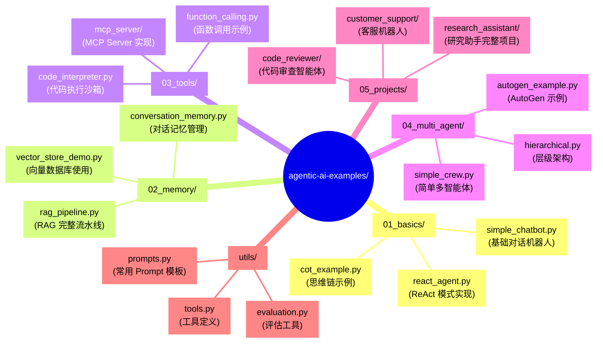

## 12.3 示例代码仓库

本书配套的代码示例和项目模板。

### 12.3.1 仓库地址

具体示例如下：

```
https://github.com/your-org/agentic-ai-examples
```

### 12.3.2 目录结构

具体示例如下：



图 12-1：示例代码仓库目录结构 (Example Repository Directory Structure)

### 12.3.3 快速开始

具体示例如下：

```bash
# 克隆仓库

git clone https://github.com/your-org/agentic-ai-examples.git

# 安装依赖

cd agentic-ai-examples
pip install -r requirements.txt

# 配置 API Key

export OPENAI_API_KEY="your-key"

# 运行示例

python 01_basics/react_agent.py
```

### 12.3.4 环境要求

- Python 3.10+
- Node.js 18+ (MCP Server)
- Docker (代码解释器)

### 12.3.5 各章节示例

### 12.3.6 第一章：范式基础

具体示例如下：

```python
# 01_basics/react_agent.py

from agents import ReActAgent

agent = ReActAgent(tools=[search, calculator])
result = agent.run("北京今天的天气如何？")
```

### 12.3.7 第三章：记忆系统

具体示例如下：

```python
# 02_memory/rag_pipeline.py

from memory import RAGPipeline

rag = RAGPipeline(
    embeddings="openai",
    vector_store="chroma"
)
rag.add_documents(docs)
answer = rag.query("什么是智能体？")
```

### 12.3.8 第四章：工具使用

具体示例如下：

```python
# 03_tools/mcp_server/server.py

from mcp.server.fastmcp import FastMCP

mcp = FastMCP("Demo Server")

@mcp.tool()
def get_weather(city: str) -> str:
    return f"{city}天气晴朗"
```

### 12.3.9 贡献指南

欢迎提交 Issue 和 Pull Request！

1. Fork 仓库
2. 创建特性分支
3. 提交更改
4. 发起 Pull Request

### 12.3.10 许可证

MIT License

---

**下一节**: [框架版本与 API 参考](12.4_api_reference.md)
