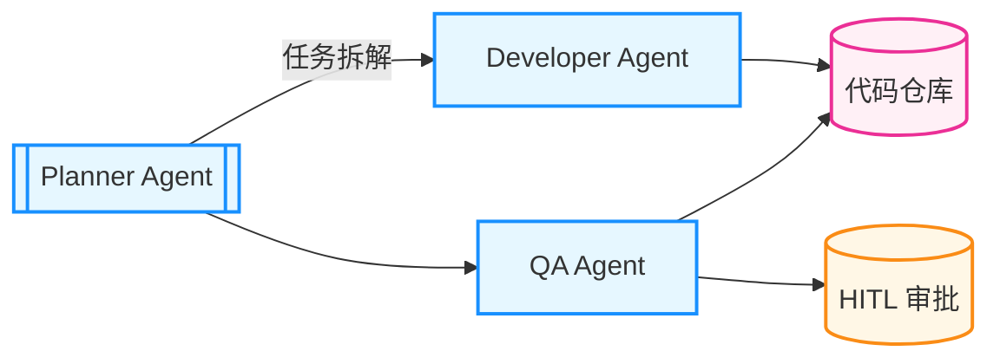
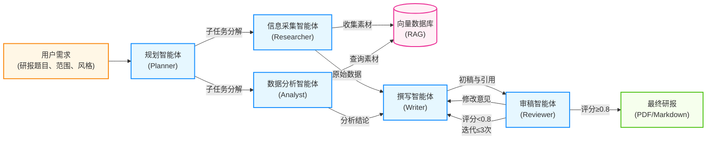

## 12.4 案例模板与检查清单

本节用于解决“如何把智能体方案写成可复用、可验收、可迭代的交付案例”。

---

### 12.4.1 标准案例呈现模板

建议所有实战案例（Case Study）统一采用如下结构。

#### 案例背景

- **行业/场景**：说明具体业务环境（如金融风控、电商客服、软件开发）。
- **用户痛点**：说明引入智能体前的核心问题（如人工流程慢、规则维护成本高、跨系统协作困难）。

#### 目标设定

- **核心目标**：一句话描述要解决的问题。
- **关键指标（KPI/SLO）**：给出可量化目标，例如：
  - 平均响应时间下降 30%
  - 任务成功率提升到 90%+
  - 人工介入率下降 40%

#### 解决方案

- **架构设计**：说明采用的智能体架构（单体/多智能体、ReAct/ToT/分层等）。
- **关键技术栈**：
  - **模型选型**：基于能力、成本、延迟、合规等因素说明选择理由。
  - **记忆设计**：短期缓存、检索增强、结构化存储如何配合。
  - **工具体系**：数据库、搜索、代码执行、外部 API 等工具如何接入与授权。
- **工作流图示**：建议使用 Mermaid 展示关键路径。


```mermaid
flowchart LR
    classDef agent fill:#e6f7ff,stroke:#1890ff,stroke-width:2px;
    classDef tool fill:#f6ffed,stroke:#52c41a,stroke-width:2px;
    classDef user fill:#fff7e6,stroke:#fa8c16,stroke-width:2px;
    classDef memory fill:#fff0f6,stroke:#eb2f96,stroke-width:2px;

    Planner[[Planner Agent]] -->|任务拆解| Dev[Developer Agent]
    Planner --> QA[QA Agent]
    Dev --> Repo[(代码仓库)]
    QA --> Repo
    QA --> Human[(HITL 审批)]

    class Planner agent;
    class Dev,QA agent;
    class Repo memory;
    class Human user;
```

图 12-4：标准协作架构图模板

#### 实施成效

- **定性结果**：哪些流程被改善、用户体验如何变化。
- **定量结果**：对照目标前后数据，例如延迟、错误率、吞吐、成本变化。

#### 风险与教训

- **主要风险**：如幻觉、工具失败、长链路延迟、越权调用、成本超预算。
- **经验沉淀**：哪些做法有效、哪些应避免、下一轮优化优先级是什么。

---

### 12.4.2 实施与验收检查清单

以下清单用于评估案例是否达到“可复现、可运行、可验收”标准。

#### A. 工程实现检查（必选）

- [ ] **输入输出定义**：是否给出输入数据结构与输出结构（建议 JSON Schema）。
- [ ] **依赖与环境**：是否列出库版本、环境变量、外部服务与权限要求。
- [ ] **核心实现**：是否提供关键流程伪代码或核心代码片段。
- [ ] **错误处理**：是否覆盖超时、拒答、工具失败、重试与降级策略。
- [ ] **可观测性**：是否说明日志、追踪、评估集或告警配置。
- [ ] **运行说明**：是否给出可执行的启动、测试、回归验证命令。

#### B. 工具开发检查（按需）

- [ ] **幂等性**：重复调用是否安全；写操作重复执行是否可控。
- [ ] **参数校验**：是否校验类型、取值范围、必填项与默认值。
- [ ] **安全边界**：是否防止路径遍历、注入、越权访问等风险。
- [ ] **高风险操作审查**：是否为敏感写操作设置 Human-in-the-loop。
- [ ] **容错机制**：是否具备超时、重试、熔断或回退策略。
- [ ] **可理解报错**：返回信息是否便于智能体进行下一步自修复。

---

### 12.4.3 版本升级前的更新检测流程

在升级模型、SDK、工具链前，建议执行以下流程：

1. **能力变更检查**：确认结构化输出、工具调用、上下文窗口、缓存机制是否变化。
2. **破坏性变更检查**：确认依赖是否有主版本升级、参数弃用或默认行为变更。
3. **回归验证**：运行评估集与关键链路回放，比较成功率、延迟、成本与安全指标。
4. **灰度发布与回滚预案**：先小流量验证，再全量；保留一键回滚路径。

---

### 12.4.4 AgentOps 指标清单（参考）

指标阈值不应“一刀切”，应由业务 SLA/SLO 定义。下表给出常见观察维度：

| 指标类别 | 具体指标 | 设定方式 | 备注 |
| :--- | :--- | :--- | :--- |
| **效果** | 任务成功率、步骤准确率 | 按业务目标设定 | 核心链路设更高阈值 |
| **性能** | 端到端延迟、首字生成时间 | 按交互体验设定 | 离线任务可放宽 |
| **成本** | 单任务词元、日均调用成本 | 按预算与 ROI 设定 | 监控异常波动 |
| **稳定性** | 工具失败率、重试成功率 | 按可用性目标设定 | 需配合告警与降级 |
| **安全** | 护栏触发率、越权调用率 | 按风控要求设定 | 高风险场景需人工审计 |

---

### 12.4.5 使用建议

- 先用 **12.4.1 模板** 写清“问题—方案—结果—风险”。
- 再用 **12.4.2 清单** 做交付前自检，确保可运行与可验收。
- 最后用 **12.4.3 + 12.4.4** 建立持续迭代与监控机制。

当案例能被新成员在最短时间内复现，并在升级后稳定运行时，模板才真正发挥价值。

---

### 12.4.6 最小可复现实验标准定义

在智能体开发与论文/案例发布中，为了确保评估的公正性与他人的可验证性，必须提供 **最小可复现实验 (Minimal Reproducible Experiment, MRE)**。一个合格的 MRE 必须以代码仓库或沙箱镜像的形式交付，并包含以下四个硬性标准：

1. **固定的基座模型与参数**：
   - 必须锁死模型版本（如 `gpt-4o-2024-05-13`）
   - 公开 `temperature`、`top_p` 等生成超参数
   - 禁止使用随时波动或会被服务商静默替换的 `latest` 标签
2. **确定性的测试集与静态评估脚本**：
   - 包含足够数量（建议至少 50 个以上）带有明确 Ground Truth 的测试用例数据文件（如 JSONL 格式）
   - 配平了指标权重的离线自动化评估脚本
3. **隔离的沙箱环境与 Mock 依赖**：
   - 所有的外部执行环境（如数据库快照、依赖服务、终端隔离系统）必须通过 Docker Compose 或 DevContainer 提供一键隔离启动配置
   - 切断对极易发生变更的不可控公网 API 服务的直接依赖
4. **透明的提示词与全链路轨迹**：
   - 不仅要公开完整的系统提示词（System Prompt）与工具 Schema 定义
   - 还应在系统中提供包含 `trace_id` 的日志回放工具
   - 并附带至少 3-5 份成功与失败的真实长上下文 Trace 日志片段用于调试对照

---

### 12.4.7 端到端案例：智能研报生成系统

本案例展示如何将全书核心知识点（任务规划、推理引擎、记忆系统、工具使用、多智能体协作、评估机制、可观测性、护栏机制）整合成一个完整的、生产级别的智能体系统。

#### 场景描述

构建一个能自主完成行业研报撰写的智能体系统。系统需要从多个信息源（公开数据、行业报告、财务数据）自动收集素材，进行数据分析与合成，最后生成结构完整、引用准确、逻辑清晰的研报文档。传统方式需要资深分析师投入 2-3 个工作日，系统应在 2-4 小时内交付初稿。

#### 架构设计


```mermaid
graph LR
    User["用户需求<br/>(研报题目、范围、风格)"] --> Planner["规划智能体<br/>(Planner)"]
    Planner -->|子任务分解| Researcher["信息采集智能体<br/>(Researcher)"]
    Planner -->|子任务分解| Analyst["数据分析智能体<br/>(Analyst)"]
    Researcher -->|收集素材| SharedDB[("向量数据库<br/>(RAG)")]
    Analyst -->|查询素材| SharedDB
    Researcher -->|原始数据| Writer["撰写智能体<br/>(Writer)"]
    Analyst -->|分析结论| Writer
    Writer -->|初稿与引用| Reviewer["审稿智能体<br/>(Reviewer)"]
    Reviewer -->|修改意见| Writer
    Reviewer -->|评分≥0.8| Output["最终研报<br/>(PDF/Markdown)"]
    Reviewer -->|评分<0.8<br/>迭代≤3次| Writer

    style User fill:#fff7e6,stroke:#fa8c16,stroke-width:2px
    style Planner fill:#e6f7ff,stroke:#1890ff,stroke-width:2px
    style Researcher fill:#e6f7ff,stroke:#1890ff,stroke-width:2px
    style Analyst fill:#e6f7ff,stroke:#1890ff,stroke-width:2px
    style Writer fill:#e6f7ff,stroke:#1890ff,stroke-width:2px
    style Reviewer fill:#e6f7ff,stroke:#1890ff,stroke-width:2px
    style SharedDB fill:#fff0f6,stroke:#eb2f96,stroke-width:2px
    style Output fill:#f6ffed,stroke:#52c41a,stroke-width:2px
```

图 12-5：智能研报生成系统架构

#### 核心组件与全书知识点映射

以下表格展示本系统如何将全书各章节的核心概念串联成统一的解决方案：

| 组件 | 对应章节 | 具体应用 |
|------|---------|---------|
| **任务规划** | 第 2 章 2.2 | Planner 使用 HTN (分层任务网络) 将“撰写行业研报”分解为“信息采集”→“数据分析”→“初稿撰写”→“评审迭代” 四个并行/串行的子任务 |
| **推理引擎**| 第 2 章 2.3 | Researcher 使用 ReAct (思考-行动-观察) 循环：**思考** 关键搜索词→**行动** 调用搜索引擎→**观察** 结果→判断是否继续搜索 |
| **记忆系统** | 第 3 章 3.4 | 所有采集的数据通过向量化存储在 RAG 数据库，Writer 在撰写时通过语义相似度检索相关素材，避免重复搜索与信息遗漏 |
| **工具使用** | 第 4 章 4.2 | Researcher 调用搜索 API、财务数据库查询、图表生成工具；Analyst 调用数据处理函数、统计分析库；Reviewer 调用语言模型评分接口 |
| **多智能体协作**| 第 5 章 5.1 | 采用 **层级架构**：Planner 作为 Supervisor 分发任务，Researcher、Analyst 并行执行，Writer 聚合结果，Reviewer 进行终审 |
| **评估机制**| 第 7 章 7.2 | Reviewer 使用 **LLM-as-Judge** 从三个维度对初稿评分：(1) 事实准确性 (0-1)；(2) 逻辑连贯性 (0-1)；(3) 格式规范性 (0-1)，综合得分 ≥ 0.8 视为通过 |
| **可观测性**| 第 9 章 9.2 | 每次任务执行都生成 **全链路 Trace**，包含唯一 `trace_id`，记录每个智能体的输入、输出、工具调用、耗时，支持事后回放与性能分析 |
| **护栏与安全**| 第 11 章 11.1 | Writer 输出的研报必须通过 **安全边界检查**：(1) 过滤敏感信息 (个人隐私、商业机密)；(2) 事实核查 (基于可信来源)；(3) 格式验证 (无恶意代码注入) |

#### 关键实现要点

**1. Planner 的任务分解策略**

```
输入: 用户需求 = {
  "题目": "2026年中国新能源汽车产业链研报",
  "字数": "5000-8000",
  "风格": "学术严谨",
  "截止日期": "2026-03-05"
}

分解过程 (HTN):
  └─ 撰写研报 (5天)
      ├─[并行] 信息采集 (2天)
      │  ├─ 搜索行业宏观数据
      │  ├─ 收集企业财报与融资信息
      │  └─ 整理产业链竞争格局
      ├─[并行] 数据分析 (2天)
      │  ├─ 统计产销量趋势
      │  ├─ 计算行业集中度指数
      │  └─ 分析成本曲线变化
      ├─[串行] 初稿撰写 (1.5天)
      │  ├─ 组织大纲与逻辑框架
      │  ├─ 填写各章节内容
      │  └─ 补充图表与引用
      └─[串行] 评审迭代 (0.5天)
         ├─ 事实核查
         ├─ 逻辑审视
         └─ 格式调整
```

**2. Researcher 的 ReAct 循环**

```
初始状态: 需要采集"新能源汽车产业链趋势"信息

第 1 轮:
  思考: "需要了解全球与中国市场规模、增速、主要参与者"
  行动: search_engine.query("global EV market size 2024-2026")
  观察: 获得 Statista、IEA、高盛分析报告
  -> 评价: 信息质量好，加入收集集合

第 2 轮:
  思考: "缺少国内重点企业的财务数据对比"
  行动: financial_db.query("比亚迪、蔚来、理想 2025年营收净利")
  观察: 获得最新财报数据
  -> 评价: 信息准确，加入收集集合

第 3 轮:
  思考: "还需要产业链各环节 (电池、芯片、充电) 的发展动态"
  行动: search_engine.query("电池产业竞争 2026 固态电池进展")
  观察: 发现宁德时代、比亚迪等电池企业的新进展
  -> 评价: 信息完整，停止搜索
```

**3. 并行执行与共享数据库**

```
时刻 t=0:
  Researcher 开始搜索 → 收集到 20 份文档
                      → 向量化并存入 RAG 数据库
  Analyst 开始数据查询 → 获取财务数据
                       → 同样向量化存入 RAG

时刻 t=1.5h:
  Researcher 完成采集
  Analyst 完成计算

时刻 t=2h:
  Writer 检索 RAG 数据库
  -> 语义搜索: "产业链竞争格局" → 返回 Researcher 采集的相关文档
  -> 语义搜索: "成本变化趋势" → 返回 Analyst 计算的数据表格

  Writer 根据关键信息片段撰写初稿
  (每个引用都标记为 [来源:文档ID:页码])
```

**4. Reviewer 的多维度评分机制**

```
初稿提交给 Reviewer

评估模板:
{
  "事实准确性": {
    "说明": "逐条验证主要观点是否有可信来源支撑",
    "检查项": [
      "市场规模数据是否与权威报告一致?",
      "企业财务数据是否与公开披露相符?",
      "重要事件时间线是否正确?"
    ],
    "评分": 0.85  // 因为某个推算有轻微假设，但主体准确
  },
  "逻辑连贯性": {
    "说明": "章节过渡、论证链条、结论推导是否合理",
    "检查项": [
      "现状分析 → 存在的问题 → 未来展望 逻辑是否流畅?",
      "是否有自相矛盾或未闭合的论述?",
      "结论是否由前文充分支撑?"
    ],
    "评分": 0.92  // 逻辑清晰，层层递进
  },
  "格式规范性": {
    "说明": "排版、图表、引用、表格是否符合学术规范",
    "检查项": [
      "标题层级是否正确?",
      "参考文献是否完整?",
      "代码、URL 是否被标记?",
      "敏感信息是否被过滤?"
    ],
    "评分": 0.95  // 基本符合，仅需微调排版
  },
  "综合评分": (0.85 + 0.92 + 0.95) / 3 = 0.907 ✓ (通过)
}

反馈给 Writer: "整体质量良好，建议调整第 3 章第 2 节的某处表述..."
```

**5. 迭代控制与降级策略**

```
流程控制:
  ┌─ Writer 初稿 (v1)
  │  │
  │  └─ Reviewer 评分: 0.78 (不通过)
  │     └─ Writer 修改 (v2)
  │        │
  │        └─ Reviewer 评分: 0.82 (通过) ✓
  │
  └─ 最终输出研报

失败情况处理:
  - 若迭代 3 次后仍评分 < 0.8，触发人工审视
  - 若单个智能体超时 (>60s)，调用降级方案：
    * Researcher 超时 → 使用缓存数据或简化查询
    * Analyst 超时 → 使用历史模板数据
    * Writer 超时 → 使用自动提纲+模板拼接
    * Reviewer 超时 → 使用规则引擎快速评分
```

#### 技术栈与部署

**模型选择**：
- **Planner**：GPT-4o (推理能力强，适合任务分解)
- **Researcher**：Claude Sonnet 4.6 (上下文长，适合多轮搜索)
- **Analyst**：GPT-4o mini (成本低，计算能力足)
- **Writer**：Claude Sonnet 4.6 (文笔细致，适合长文本生成)
- **Reviewer**：GPT-4o (评估精度高)

**关键库与服务**：
- 向量数据库：Pinecone 或本地 Milvus
- 搜索 API：Google Custom Search API、Bing Search API
- 财务数据：东方财富 API 或 Yahoo Finance
- 托管平台：AWS Lambda / Google Cloud Run (无服务器)

#### 成本与效率分析

单篇研报（约 5000 字）的成本估算：

```
API 调用成本分解:

Planner (任务分解):
  - tokens: ~2,000
  - 成本: ~$0.01 (使用 GPT-4o mini)

Researcher (5 次搜索循环):
  - tokens: ~15,000 (包含搜索结果文本)
  - 成本: ~$0.08

Analyst (数据计算与表格生成):
  - tokens: ~8,000
  - 成本: ~$0.03

Writer (初稿 + 2 次修改):
  - tokens: ~10,000 × 2.5 次迭代 = ~25,000
  - 成本: ~$0.15

Reviewer (2 次评审):
  - tokens: ~5,000 × 2 = ~10,000
  - 成本: ~$0.05

总 API 成本: ~$0.32 (使用混合模型策略)
总词元: ~60,000 tokens

对标:
  - 人工撰写成本: $200-500 (资深分析师日薪)
  - 系统生成成本: $0.32
  - 效率提升: 625-1562 倍
  - 时间: 人工 2-3 天 vs 系统 2-4 小时 (10-36 倍加速)
```

#### 常见问题与应对策略

**Q1: 多个信息源数据冲突如何处理？**

应对策略：
1. Researcher 标记每条信息的来源可信度 (权威程度、发布时间)
2. Writer 在撰写时优先采信权威来源 (官方数据 > 大型咨询公司 > 自媒体)
3. 如存在重大分歧，在报告中明确标注为“业界存在不同观点”
4. Reviewer 检查是否正确处理了冲突信息

示例：
```
问题: A 市场调研说"2026年EV市场份额40%"，B 分析师说"45%"

处理:
  Writer 写法: "根据高盛报告，市场份额预计达 40%；
               而摩根士丹利认为可达 45%，
               我们倾向采信高盛的保守估计，但不排除乐观情景。"

  Reviewer 验证: ✓ 既展示了主流观点，也承认了分歧
```

**Q2: 生成文本中的幻觉风险如何降低？**

应对策略：
1. **强制引用**：Writer 生成每个观点都必须附带引用标记 `[来源:doc_id:页码]`
2. **Reviewer 逐条验证**：在评分前，Reviewer 对每个核心主张进行 fact-check：
   - 是否存在对应的引用？
   - 引用的内容是否真的支持该主张？
   - 是否存在过度推演或张冠李戴？
3. **失败案例反馈**：若检测到幻觉，直接返回具体问题给 Writer，而非模糊批评

示例：
```
初稿第 3 段:
  "比亚迪在电池领域的成本竞争力全球领先。"

Reviewer 查验:
  - 找不到直接引用支撑这个观点
  - 修改建议: "改为"比亚迪通过规模效应降低电池成本 [来源:比亚迪2025财报]"
               或补充引用来源"
```

**Q3: 单个智能体超时或调用失败如何处理？**

应对策略：
- **预设超时阈值**：60 秒
- **触发降级方案**：

| 智能体 | 正常方案 | 降级方案 | 最后方案 |
|--------|---------|---------|---------|
| Researcher | 主动搜索 + RAG 写入 | 使用缓存的历史数据 | 用研报模板的数据占位符 |
| Analyst | 调用数据库 + 计算 | 使用历史计算结果 | 使用行业平均值 |
| Writer | 从头生成 | 使用带引用的摘要拼接 | 使用预制模板 |
| Reviewer | 完整评分 | 快速规则评分 (检查格式与长度) | 标记为“待人工审视” |

**Q4: 如何确保最终研报的可维护性与可验证性？**

应对策略：
1. **元数据记录**：在研报文档头部记录：
   ```yaml
   ---
   title: "2026年中国新能源汽车产业链研报"
   generated_by: "AI Research Report System v1.2"
   trace_id: "report_20260305_a7f3b2c9"
   generation_time: "2026-03-05 14:30:00"
   models_used:
     - planner: "gpt-4o-2024-05-13"
     - researcher: "claude-sonnet-4-6"
     - writer: "claude-sonnet-4-6"
     - reviewer: "gpt-4o-2024-05-13"
   total_tokens: 60200
   total_cost: $0.32
   review_score: 0.91
   sources_count: 42
   ---
   ```

2. **完整引用链接**：每个观点都能追溯到原始来源（文档 ID、页码、引用文本）
3. **Trace 回放**：保存整个执行链路，支持事后调试与改进验证

#### 集成检查清单

使用 **12.4.2** 中的工程实现检查清单验证本系统：

- [ ] **输入输出定义**：用户输入 (题目、字数、风格) → 输出 (Markdown 研报 + metadata)
- [ ] **依赖与环境**：列出所需 API key、数据库连接、模型版本 (✓ 见技术栈部分)
- [ ] **核心实现**：提供各智能体的提示词模板与工具定义 (见后续实施阶段)
- [ ] **错误处理**：超时 60s 触发降级、幻觉检测与修正循环、迭代最多 3 次 (✓)
- [ ] **可观测性**：全链路 Trace ID、各智能体耗时与 token 统计 (✓)
- [ ] **运行说明**：提供启动脚本、测试用例、性能基准 (待实施)

---

**上一节**: [项目说明文件规范指南](12.3_agents_md.md)

**返回主页**: [返回目录](../SUMMARY.md)
