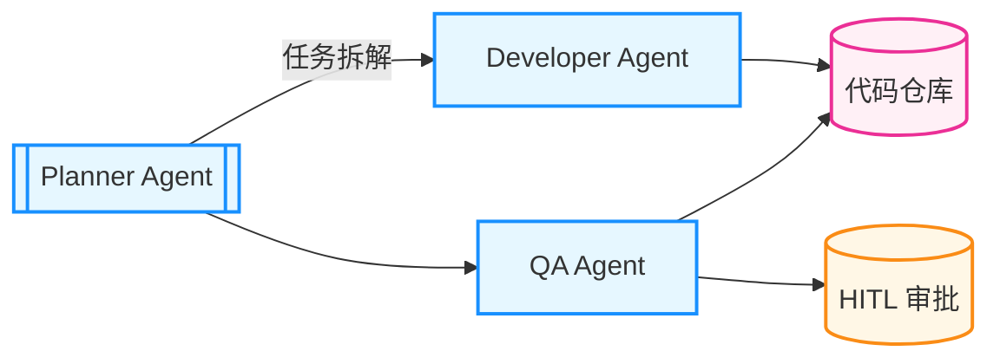
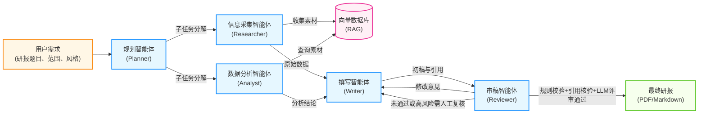

## 12.4 案例模板与检查清单

本节用于解决“如何把智能体方案写成可复用、可验收、可迭代的交付案例”。

---

### 12.4.1 标准案例呈现模板

建议所有实战案例（Case Study）统一采用如下结构。

#### 案例背景

- **行业/场景**：说明具体业务环境（如金融风控、电商客服、软件开发）。
- **用户痛点**：说明引入智能体前的核心问题（如人工流程慢、规则维护成本高、跨系统协作困难）。

#### 目标设定

- **核心目标**：一句话描述要解决的问题。
- **关键指标（KPI/SLO）**：给出可量化目标，例如：
  - 平均响应时间下降 30%
  - 任务成功率提升到 90%+
  - 人工介入率下降 40%

#### 解决方案

- **架构设计**：说明采用的智能体架构（单体/多智能体、ReAct/ToT/分层等）。
- **关键技术栈**：
  - **模型选型**：基于能力、成本、延迟、合规等因素说明选择理由。
  - **记忆设计**：短期缓存、检索增强、结构化存储如何配合。
  - **工具体系**：数据库、搜索、代码执行、外部 API 等工具如何接入与授权。
- **工作流图示**：建议使用 Mermaid 展示关键路径。


```mermaid
flowchart LR
    classDef agent fill:#e6f7ff,stroke:#1890ff,stroke-width:2px;
    classDef tool fill:#f6ffed,stroke:#52c41a,stroke-width:2px;
    classDef user fill:#fff7e6,stroke:#fa8c16,stroke-width:2px;
    classDef memory fill:#fff0f6,stroke:#eb2f96,stroke-width:2px;

    Planner[[Planner Agent]] -->|任务拆解| Dev[Developer Agent]
    Planner --> QA[QA Agent]
    Dev --> Repo[(代码仓库)]
    QA --> Repo
    QA --> Human[(HITL 审批)]

    class Planner agent;
    class Dev,QA agent;
    class Repo memory;
    class Human user;
```

图 12-4：标准协作架构图模板

#### 实施成效

- **定性结果**：哪些流程被改善、用户体验如何变化。
- **定量结果**：对照目标前后数据，例如延迟、错误率、吞吐、成本变化。

#### 风险与教训

- **主要风险**：如幻觉、工具失败、长链路延迟、越权调用、成本超预算。
- **经验沉淀**：哪些做法有效、哪些应避免、下一轮优化优先级是什么。

---

### 12.4.2 实施与验收检查清单

以下清单用于评估案例是否达到“可复现、可运行、可验收”标准。

#### A. 工程实现检查（必选）

- [ ] **输入输出定义**：是否给出输入数据结构与输出结构（建议 JSON Schema）。
- [ ] **依赖与环境**：是否列出库版本、环境变量、外部服务与权限要求。
- [ ] **核心实现**：是否提供关键流程伪代码或核心代码片段。
- [ ] **错误处理**：是否覆盖超时、拒答、工具失败、重试与降级策略。
- [ ] **可观测性**：是否说明日志、追踪、评估集或告警配置。
- [ ] **运行说明**：是否给出可执行的启动、测试、回归验证命令。

#### B. 工具开发检查（按需）

- [ ] **幂等性**：重复调用是否安全；写操作重复执行是否可控。
- [ ] **参数校验**：是否校验类型、取值范围、必填项与默认值。
- [ ] **安全边界**：是否防止路径遍历、注入、越权访问等风险。
- [ ] **高风险操作审查**：是否为敏感写操作设置 Human-in-the-loop。
- [ ] **容错机制**：是否具备超时、重试、熔断或回退策略。
- [ ] **可理解报错**：返回信息是否便于智能体进行下一步自修复。

---

### 12.4.3 版本升级前的更新检测流程

在升级模型、SDK、工具链前，建议执行以下流程：

1. **能力变更检查**：确认结构化输出、工具调用、上下文窗口、缓存机制是否变化。
2. **破坏性变更检查**：确认依赖是否有主版本升级、参数弃用或默认行为变更。
3. **回归验证**：运行评估集与关键链路回放，比较成功率、延迟、成本与安全指标。
4. **灰度发布与回滚预案**：先小流量验证，再全量；保留一键回滚路径。

---

### 12.4.4 AgentOps 指标清单（参考）

指标阈值不应“一刀切”，应由业务 SLA/SLO 定义。下表给出常见观察维度：

| 指标类别 | 具体指标 | 设定方式 | 备注 |
| :--- | :--- | :--- | :--- |
| **效果** | 任务成功率、步骤准确率 | 按业务目标设定 | 核心链路设更高阈值 |
| **性能** | 端到端延迟、首字生成时间 | 按交互体验设定 | 离线任务可放宽 |
| **成本** | 单任务词元、日均调用成本 | 按预算与 ROI 设定 | 监控异常波动 |
| **稳定性** | 工具失败率、重试成功率 | 按可用性目标设定 | 需配合告警与降级 |
| **安全** | 护栏触发率、越权调用率 | 按风控要求设定 | 高风险场景需人工审计 |

---

### 12.4.5 使用建议

- 先用 **12.4.1 模板** 写清“问题—方案—结果—风险”。
- 再用 **12.4.2 清单** 做交付前自检，确保可运行与可验收。
- 最后用 **12.4.3 + 12.4.4** 建立持续迭代与监控机制。

当案例能被新成员在最短时间内复现，并在升级后稳定运行时，模板才真正发挥价值。

---

### 12.4.6 最小可复现实验标准定义

一个合格的 MRE (Minimal Reproducible Experiment) 必须满足以下四个硬性标准：

| 标准 | 要求 |
|------|------|
| **固定模型与参数** | 锁死模型版本（如 `claude-sonnet-4-6` 或 `gpt-4o-2024-05-13`）；公开 `temperature`、`top_p` 等超参数；禁用 `latest` 标签 |
| **确定性测试集** | ≥50 个测试用例，含 Ground Truth（JSONL 格式）；配权重离线自动化评估脚本 |
| **隔离沙箱环境** | Docker Compose/DevContainer 一键启动；Mock 依赖；切断不可控公网 API 直接依赖 |
| **透明提示词与轨迹** | 公开完整系统提示词与工具 Schema；提供 `trace_id` 日志回放工具；附带 3-5 份真实 Trace 日志片段 |

---

### 12.4.7 端到端案例：智能研报生成系统

本案例展示如何将全书核心知识点（任务规划、推理引擎、记忆系统、工具使用、多智能体协作、评估机制、可观测性、护栏机制）整合成一个可复用的端到端参考蓝图（包含待实施环节）。

#### 场景描述

构建一个能自主完成行业研报撰写的智能体系统。系统需要从多个信息源（公开数据、行业报告、财务数据）自动收集素材，进行数据分析与合成，最后生成结构完整、引用准确、逻辑清晰的研报文档。传统方式需要资深分析师投入 2-3 个工作日，系统应在 2-4 小时内交付初稿。

#### 架构设计

下图展示了从任务分解到质量门禁与交付的整体协作路径：


```mermaid
graph LR
    User["用户需求<br/>(研报题目、范围、风格)"] --> Planner["规划智能体<br/>(Planner)"]
    Planner -->|子任务分解| Researcher["信息采集智能体<br/>(Researcher)"]
    Planner -->|子任务分解| Analyst["数据分析智能体<br/>(Analyst)"]
    Researcher -->|收集素材| SharedDB[("向量数据库<br/>(RAG)")]
    Analyst -->|查询素材| SharedDB
    Researcher -->|原始数据| Writer["撰写智能体<br/>(Writer)"]
    Analyst -->|分析结论| Writer
    Writer -->|初稿与引用| Reviewer["审稿智能体<br/>(Reviewer)"]
    Reviewer -->|修改意见| Writer
    Reviewer -->|规则校验+引用核验+LLM评审通过| Output["最终研报<br/>(PDF/Markdown)"]
    Reviewer -->|未通过或高风险需人工复核| Writer

    style User fill:#fff7e6,stroke:#fa8c16,stroke-width:2px
    style Planner fill:#e6f7ff,stroke:#1890ff,stroke-width:2px
    style Researcher fill:#e6f7ff,stroke:#1890ff,stroke-width:2px
    style Analyst fill:#e6f7ff,stroke:#1890ff,stroke-width:2px
    style Writer fill:#e6f7ff,stroke:#1890ff,stroke-width:2px
    style Reviewer fill:#e6f7ff,stroke:#1890ff,stroke-width:2px
    style SharedDB fill:#fff0f6,stroke:#eb2f96,stroke-width:2px
    style Output fill:#f6ffed,stroke:#52c41a,stroke-width:2px
```

图 12-5：智能研报生成系统架构

#### 核心组件与全书知识点映射

以下表格展示本系统如何将全书各章节的核心概念串联成统一的解决方案：

| 组件 | 对应章节 | 具体应用 |
|------|---------|---------|
| **任务规划** | 第 2 章 2.2 | Planner 使用 HTN (分层任务网络) 将“撰写行业研报”分解为“信息采集”→“数据分析”→“初稿撰写”→“评审迭代” 四个并行/串行的子任务 |
| **推理引擎**| 第 2 章 2.3 | Researcher 使用 ReAct (思考-行动-观察) 循环：**思考** 关键搜索词→**行动** 调用搜索引擎→**观察** 结果→判断是否继续搜索 |
| **记忆系统** | 第 3 章 3.4 | 非结构化材料（报告、新闻、说明文档）向量化存储在 RAG 数据库；结构化财务数据保留在表格/数据库中，Writer 按需进行混合检索与引用拼接 |
| **工具使用** | 第 4 章 4.2 | Researcher 调用搜索 API、财务数据库查询、图表生成工具；Analyst 调用数据处理函数、统计分析库；Reviewer 调用语言模型评分接口 |
| **多智能体协作**| 第 5 章 5.1 | 采用 **层级架构**：Planner 作为 Supervisor 分发任务，Researcher、Analyst 并行执行，Writer 聚合结果，Reviewer 进行终审 |
| **评估机制**| 第 7 章 7.2 | Reviewer 采用组合门禁：规则校验 + 引用核验 + **LLM-as-Judge** 评分；高风险场景触发人工复核，不以单一分数直接放行 |
| **可观测性**| 第 9 章 9.2 | 每次任务执行都生成 **全链路 Trace**，包含唯一 `trace_id`，记录每个智能体的输入、输出、工具调用、耗时，支持事后回放与性能分析 |
| **护栏与安全**| 第 11 章 11.1 | Writer 输出的研报必须通过 **安全边界检查**：(1) 过滤敏感信息 (个人隐私、商业机密)；(2) 事实核查 (基于可信来源)；(3) 格式验证 (无恶意代码注入) |

#### 关键实现要点

**1. Planner 的任务分解策略（HTN 框架）**

```text
撰写研报
├─[并行] 信息采集：搜索宏观数据、企业财报、竞争格局 (2d)
├─[并行] 数据分析：产销趋势、集中度、成本曲线 (2d)
├─[串行] 初稿撰写：大纲→内容→图表引用 (1.5d)
└─[串行] 评审迭代：事实核查、逻辑审视、格式调整 (0.5d)
```

**2. Researcher 的 ReAct 循环**

```text
轮次 | 思考 | 行动 | 观察 | 结果
-----|------|------|------|------
1 | 需市场规模和主要参与者 | search("EV market 2024-26") | Statista/IEA报告 | ✓ 加入
2 | 缺国内企业财务对比 | financial_db("比亚迪/蔚来/理想2025") | 财报数据 | ✓ 加入
3 | 需产业链各环节动态 | search("电池竞争、固态电池2026") | 宁德/比亚迪进展 | ✓ 停止
```

**3. 并行执行与共享数据库**

```text
t=0h:  Researcher 搜索 (20份文档) → RAG数据库
       Analyst 数据查询 → 结构化表格

t=1.5h: 两者完成

t=2h:  Writer 混合检索
       - 语义搜索: "竞争格局" → Researcher 文档
       - SQL 查询: "成本趋势" → Analyst 表格
       - 组织初稿，标记引用 [来源:docID:页码]
```

**4. Reviewer 的多维度评分机制**

```text
初稿提交给 Reviewer

评估模板:
{
  "事实准确性": {
    "说明": "逐条验证主要观点是否有可信来源支撑",
    "检查项": [
      "市场规模数据是否与权威报告一致?",
      "企业财务数据是否与公开披露相符?",
      "重要事件时间线是否正确?"
    ],
    "评分": 0.85  // 因为某个推算有轻微假设，但主体准确
  },
  "逻辑连贯性": {
    "说明": "章节过渡、论证链条、结论推导是否合理",
    "检查项": [
      "现状分析 → 存在的问题 → 未来展望 逻辑是否流畅?",
      "是否有自相矛盾或未闭合的论述?",
      "结论是否由前文充分支撑?"
    ],
    "评分": 0.92  // 逻辑清晰，层层递进
  },
  "格式规范性": {
    "说明": "排版、图表、引用、表格是否符合学术规范",
    "检查项": [
      "标题层级是否正确?",
      "参考文献是否完整?",
      "代码、URL 是否被标记?",
      "敏感信息是否被过滤?"
    ],
    "评分": 0.95  // 基本符合，仅需微调排版
  },
  "综合评分": (0.85 + 0.92 + 0.95) / 3 = 0.907
}

放行规则:
  1) 规则校验通过（格式、敏感信息、基础一致性）
  2) 引用核验通过（关键结论可追溯到可信来源）
  3) LLM 评审分数达标（例如 >= 0.8）
  4) 高风险场景进入人工复核（HITL）

反馈给 Writer: "整体质量良好，建议调整第 3 章第 2 节的某处表述..."
```

**5. 迭代控制与降级策略**

```text
流程控制:
  ┌─ Writer 初稿 (v1)
  │  │
  │  └─ 组合门禁未通过 (不通过)
  │     └─ Writer 修改 (v2)
  │        │
  │        └─ 组合门禁通过 (通过) ✓
  │
  └─ 最终输出研报

失败情况处理:
  - 若迭代 3 次后仍评分 < 0.8，触发人工审视
  - 若单个智能体超时 (>60s)，调用降级方案：
    * Researcher 超时 → 使用缓存数据或简化查询
    * Analyst 超时 → 使用历史模板数据
    * Writer 超时 → 使用自动提纲+模板拼接
    * Reviewer 超时 → 使用规则引擎快速评分
```

#### 技术栈与部署

**模型选择**：

本案例采用的模型配置旨在平衡推理精度、成本与延迟，各组件选择理由如下：

- **Planner**：Claude Opus 4.7（推理能力强、Token 效率高，适合复杂任务分解）。Opus 4.7 支持 Adaptive Thinking，可在规划阶段进行深度推理。备选方案为 GPT-5.5（或 GPT-5.4），推理能力相近，可根据供应商稳定性与成本灵活选择。
- **Researcher**：Claude Sonnet 4.6（成本与能力平衡最优，支持 Extended Thinking，上下文长度足以处理多轮搜索结果聚合）。
- **Analyst**：GPT-5.4 mini（成本低，数据分析与统计计算能力充分）。因该组件无需处理长上下文，迷你版本足以完成工作。
- **Writer**：Claude Sonnet 4.6（文笔细致，长文本生成效果优，支持 Extended Thinking 增强文章逻辑连贯性）。
- **Reviewer**：Claude Opus 4.7（评估精度高、推理能力强）或 GPT-5.5（可与 Planner 保持一致）。

> **生产部署建议**：为降低跨模型系列的协议与维护复杂度，生产环境建议选择单一模型系列（全 Claude 或全 OpenAI），在整体成本与性能目标框架下进行微调。上述配置适于技术原型与性能基准测试。

**关键库与服务**：
- 向量数据库：Pinecone 或本地 Milvus
- 搜索 API：Google Custom Search API、Bing Search API
- 财务数据：东方财富 API 或 Yahoo Finance
- 托管平台：AWS Lambda / Google Cloud Run (无服务器)

#### 成本与效率分析

单篇研报（约 5000 字）的 LLM Token 成本：

| 组件 | Tokens | 成本 |
|------|--------|------|
| Planner (任务分解) | 2K | $0.03 |
| Researcher (5 轮搜索) | 15K | $0.08 |
| Analyst (数据计算) | 8K | $0.03 |
| Writer (初稿+2修改) | 25K | $0.15 |
| Reviewer (2 次评审) | 10K | $0.05 |
| **总计** | **60K** | **$0.34** |

**对标**：人工成本 $200-500（2-3 天）；系统成本 $0.34（2-4 小时）；效率提升 625-1562 倍

#### 常见问题与应对策略

**Q1: 多个信息源数据冲突如何处理？**

Researcher 标记来源可信度；Writer 优先采信权威来源（官方 > 咨询公司 > 自媒体）；存在重大分歧时标注”业界存在不同观点”；Reviewer 验证冲突处理正确性。

示例：EV 市场份额冲突（40% vs 45%）→ Writer 写：”高盛预计 40%，摩根士丹利预计 45%，我们倾向保守估计” → Reviewer 验证 ✓

**Q2: 生成文本中的幻觉风险如何降低？**

强制引用：每个观点附带 `[来源:doc_id:页码]`。Reviewer 逐条 fact-check 引用有效性。若检测幻觉，返回具体问题给 Writer。

示例：原文 “比亚迪电池全球领先” → 无引用 → Reviewer 要求修改为 “通过规模效应降低成本 [比亚迪2025财报]”

**Q3: 单个智能体超时（>60s）如何处理？**

触发降级方案：Researcher 用缓存数据 → 模板占位符；Analyst 用历史结果 → 行业平均值；Writer 用摘要拼接 → 预制模板；Reviewer 用规则评分 → 标记待人工审视。

**Q4: 如何确保研报的可维护性与可验证性？**

(1) 元数据记录：trace_id、模型版本、tokens、成本、评分、源数量；(2) 完整引用链接追溯到原始来源；(3) 保存全链路 Trace 支持事后回放与改进验证。

#### 集成检查清单

使用 **12.4.2** 中的工程实现检查清单验证本系统：

- [x] **输入输出定义**：用户输入 (题目、字数、风格) → 输出 (Markdown 研报 + metadata)
- [x] **依赖与环境**：列出所需 API key、数据库连接、模型版本 (✓ 见技术栈部分)
- [ ] **核心实现**：提供各智能体的提示词模板与工具定义 (见后续实施阶段)
- [x] **错误处理**：超时 60s 触发降级、幻觉检测与修正循环、迭代最多 3 次 (✓)
- [x] **可观测性**：全链路 Trace ID、各智能体耗时与 token 统计 (✓)
- [ ] **运行说明**：提供启动脚本、测试用例、性能基准 (待实施)

---

**上一节**: [AGENTS.md 规范指南](12.3_agents_md.md)

**返回主页**: [返回目录](../README.md)
