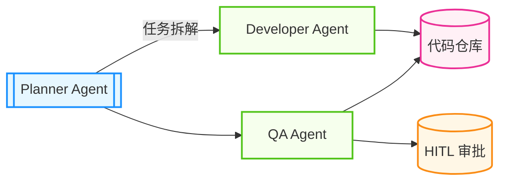

## 12.4 案例模板与检查清单

本节用于解决“如何把智能体方案写成可复用、可验收、可迭代的交付案例”。

---

### 12.4.1 标准案例呈现模板

建议所有实战案例（Case Study）统一采用如下结构。

#### 案例背景

- **行业/场景**：说明具体业务环境（如金融风控、电商客服、软件开发）。
- **用户痛点**：说明引入智能体前的核心问题（如人工流程慢、规则维护成本高、跨系统协作困难）。

#### 目标设定

- **核心目标**：一句话描述要解决的问题。
- **关键指标（KPI/SLO）**：给出可量化目标，例如：
  - 平均响应时间下降 30%
  - 任务成功率提升到 90%+
  - 人工介入率下降 40%

#### 解决方案

- **架构设计**：说明采用的智能体架构（单体/多智能体、ReAct/ToT/分层等）。
- **关键技术栈**：
  - **模型选型**：基于能力、成本、延迟、合规等因素说明选择理由。
  - **记忆设计**：短期缓存、检索增强、结构化存储如何配合。
  - **工具体系**：数据库、搜索、代码执行、外部 API 等工具如何接入与授权。
- **工作流图示**：建议使用 Mermaid 展示关键路径。

图 12-4：标准协作架构图模板

#### 实施成效

- **定性结果**：哪些流程被改善、用户体验如何变化。
- **定量结果**：对照目标前后数据，例如延迟、错误率、吞吐、成本变化。

#### 风险与教训

- **主要风险**：如幻觉、工具失败、长链路延迟、越权调用、成本超预算。
- **经验沉淀**：哪些做法有效、哪些应避免、下一轮优化优先级是什么。

---

### 12.4.2 实施与验收检查清单

以下清单用于评估案例是否达到“可复现、可运行、可验收”标准。

#### A. 工程实现检查（必选）

- [ ] **输入输出定义**：是否给出输入数据结构与输出结构（建议 JSON Schema）。
- [ ] **依赖与环境**：是否列出库版本、环境变量、外部服务与权限要求。
- [ ] **核心实现**：是否提供关键流程伪代码或核心代码片段。
- [ ] **错误处理**：是否覆盖超时、拒答、工具失败、重试与降级策略。
- [ ] **可观测性**：是否说明日志、追踪、评估集或告警配置。
- [ ] **运行说明**：是否给出可执行的启动、测试、回归验证命令。

#### B. 工具开发检查（按需）

- [ ] **幂等性**：重复调用是否安全；写操作重复执行是否可控。
- [ ] **参数校验**：是否校验类型、取值范围、必填项与默认值。
- [ ] **安全边界**：是否防止路径遍历、注入、越权访问等风险。
- [ ] **高风险操作审查**：是否为敏感写操作设置 Human-in-the-loop。
- [ ] **容错机制**：是否具备超时、重试、熔断或回退策略。
- [ ] **可理解报错**：返回信息是否便于智能体进行下一步自修复。

---

### 12.4.3 版本升级前的更新检测流程

在升级模型、SDK、工具链前，建议执行以下流程：

1. **能力变更检查**：确认结构化输出、工具调用、上下文窗口、缓存机制是否变化。
2. **破坏性变更检查**：确认依赖是否有主版本升级、参数弃用或默认行为变更。
3. **回归验证**：运行评估集与关键链路回放，比较成功率、延迟、成本与安全指标。
4. **灰度发布与回滚预案**：先小流量验证，再全量；保留一键回滚路径。

---

### 12.4.4 AgentOps 指标清单（参考）

指标阈值不应“一刀切”，应由业务 SLA/SLO 定义。下表给出常见观察维度：

| 指标类别 | 具体指标 | 设定方式 | 备注 |
| :--- | :--- | :--- | :--- |
| **效果** | 任务成功率、步骤准确率 | 按业务目标设定 | 核心链路设更高阈值 |
| **性能** | 端到端延迟、首字生成时间 | 按交互体验设定 | 离线任务可放宽 |
| **成本** | 单任务词元、日均调用成本 | 按预算与 ROI 设定 | 监控异常波动 |
| **稳定性** | 工具失败率、重试成功率 | 按可用性目标设定 | 需配合告警与降级 |
| **安全** | 护栏触发率、越权调用率 | 按风控要求设定 | 高风险场景需人工审计 |

---

### 12.4.5 使用建议

- 先用 **12.4.1 模板**写清“问题—方案—结果—风险”。
- 再用 **12.4.2 清单**做交付前自检，确保可运行与可验收。
- 最后用 **12.4.3 + 12.4.4**建立持续迭代与监控机制。

当案例能被新成员在最短时间内复现，并在升级后稳定运行时，模板才真正发挥价值。
