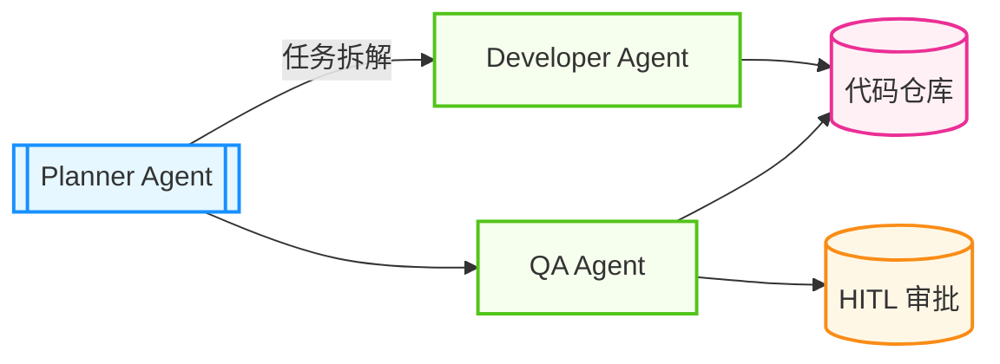

## 12.7 案例模板与检查清单

为了确保本书案例的专业性与一致性，所有新增或修改的案例必须遵循以下结构化模板。

### 12.7.1 标准案例呈现模板

所有实战案例（Case Study）应包含以下核心模块：

#### 案例背景

* **行业/场景**：明确案例发生的具体环境（如：金融风控、电商客服、软件开发）。
* **用户痛点**：在引入智能体之前面临的主要挑战（如：以前主要靠人工且效率低、传统规则引擎维护成本高）。

#### 目标设定

* **核心目标**：一句话概括要解决的问题。
* **关键指标**：量化的成功标准（如：响应时间显著降低、准确率显著提升、人工成本下降）。

#### 解决方案

* **架构设计**：使用的智能体架构（单体/多智能体、ReAct/ToT/Hierarchical 等）。
* **关键技术栈**：
    * **模型选型**：按能力与约束选择（指令遵循、工具调用、成本、延迟、合规）。
    * **记忆设计**：缓存、向量检索与结构化存储的组合。
    * **工具集**：数据库、搜索、代码执行等工具能力，以及工具服务协议的接入方式。
* **工作流图示**：推荐使用 Mermaid 流程图展示数据流向

图 12-4：标准协作架构图模板

#### 实施成效

* **定性分析**：解决了哪些具体问题，用户体验如何改善。
* **定量数据**：与设定目标的对比（例如延迟下降、错误率下降、吞吐提升）。

#### 风险与教训

* **遇到的坑**：实施过程中的主要障碍（如：幻觉控制、延迟优化、成本超支）。
* **改进建议**：对后来者的建议及未来的迭代方向。

---

### 12.7.2 工程落地检查清单

在描述工程实现部分时，请核对是否包含以下要素：

- [ ] **输入输出定义**：明确智能体的输入数据格式（JSON Schema）和预期输出结构。
- [ ] **依赖说明**：列出所需的库、API Key、环境变量或外部服务。
- [ ] **核心代码片段**：提供关键逻辑的伪代码或 Python 代码（需添加注释，展示核心 Logic）。
- [ ] **环境配置**：简要说明运行所需的软硬件环境（如 Python 版本、Docker 容器）。
- [ ] **错误处理**：说明如何处理常见异常（如：网络超时、模型拒答、工具调用失败）。
- [ ] **可观测性**：是否添加了追踪与评估配置代码或说明。

---

### 12.7.3 更新检测流程

建议在每次升级模型、框架或工具链之前执行以下检查，以保持系统的可控性：

1. **能力变更**：检查模型/SDK 是否存在工具调用、结构化输出、上下文与缓存机制的变化。
2. **破坏性变更**：检查依赖是否存在主版本升级或弃用策略。
3. **回归验证**：运行自动化评估集与关键链路回放，确认行为差异在可接受范围。

---

### 12.7.4 AgentOps 指标清单（参考）

| 指标类别 | 具体指标 | 推荐阈值 | 备注 |
| :--- | :--- | :--- | :--- |
| **效果** | 任务成功率 | 由业务设定 | 低于阈值需优化提示词或流程 |
| | 步骤准确率 | 由业务设定 | 关键步骤需要更高阈值 |
| **性能** | 端到端延迟 | 由业务设定 | 离线任务可放宽 |
| | 首字生成时间 | 由业务设定 | 影响用户体验 |
| **成本** | 词元消耗 | 依预算 | 需监控异常波动 |
| **稳定性** | 工具调用失败率 | 由业务设定 | 需完善错误重试机制 |
| **安全** | 护栏触发次数 | 趋近 0 | 需人工审计触发案例 |

---

### 12.7.5 工具开发检查清单

开发自定义工具时，必须通过以下核查：

- [ ] **幂等性**：
    - [ ] 读操作是否真正无副作用？
    - [ ] 写操作重复执行是否安全？例如：`create_user` 如果用户已存在，是报错还是返回现有 ID？
- [ ] **安全性**：
    - [ ] 是否校验了参数类型和范围？
    - [ ] 是否防止了路径遍历攻击？例如 `../etc/passwd`
    - [ ] 敏感操作是否标记为 `Human-in-the-loop`？
- [ ] **容错性**：
    - [ ] API 超时是否有重试机制？
    - [ ] 错误信息是否对 LLM 友好？（不要返 500 HTML，要返 "查询超时，建议缩小时间范围重试"）
- [ ] **可观测性**：
    - [ ] 是否记录了入参和出参的 Log/Trace？
    - [ ] 耗时操作是否有进度反馈？
