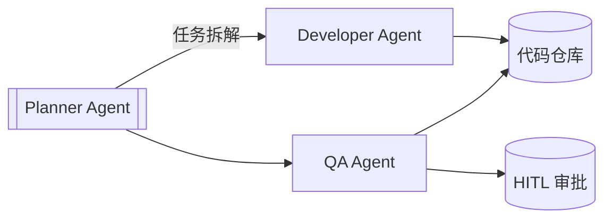

## 12.7 案例模板与 Checklist

为了确保本书案例的专业性与一致性，所有新增或修改的案例必须遵循以下结构化模板。

### 12.7.1 标准案例呈现模板

所有实战案例（Case Study）应包含以下核心模块：

#### 案例背景

*   **行业/场景**：明确案例发生的具体环境（如：金融风控、电商客服、软件开发）。
*   **用户痛点**：在引入智能体之前面临的主要挑战（如：以前主要靠人工且效率低、传统规则引擎维护成本高）。

#### 目标设定

*   **核心目标**：一句话概括要解决的问题。
*   **关键指标 (KPIs)**：量化的成功标准（如：响应时间 < 2s，准确率 > 95%，人力成本降低 50%）。

#### 解决方案

*   **架构设计**：使用的智能体架构（单体/多智能体、ReAct/ToT/Hierarchical 等）。
*   **关键技术栈**：
    *   **模型选型**：(如：Claude 3.5 Sonnet, OpenAI o3, DeepSeek-R1)
    *   **记忆设计**：(如：Redis 缓存会话，Pinecone 存储知识库)
    *   **工具集**：(如：MCP Server 连接数据库, Web Search, Code Interpreter)
*   **工作流图示**：(推荐使用 Mermaid 流程图展示数据流向)

#### 实施成效

*   **定性分析**：解决了哪些具体问题，用户体验如何改善。
*   **定量数据**：与设定目标的对比（如：处理效率提升 300%）。

#### 风险与教训 (Risks & Lessons)

*   **遇到的坑**：实施过程中的主要障碍（如：幻觉控制、延迟优化、成本超支）。
*   **改进建议**：对后来者的建议及未来的迭代方向。

---

### 12.7.2 工程落地 Checklist

在描述工程实现部分时，请核对是否包含以下要素：

- [ ] **输入输出定义**：明确智能体的输入数据格式（JSON Schema）和预期输出结构。
- [ ] **依赖说明**：列出所需的库、API Key、环境变量或外部服务。
- [ ] **核心代码片段**：提供关键逻辑的伪代码或 Python 代码（需添加注释，展示核心 Logic）。
- [ ] **环境配置**：简要说明运行所需的软硬件环境（如 Python 版本、Docker 容器）。
- [ ] **错误处理**：说明如何处理常见异常（如：网络超时、模型拒答、工具调用失败）。
- [ ] **可观测性**：是否添加了 Tracing（如 LangSmith/Arize Phoenix）配置代码或说明。

---

### 12.7.3 更新检测流程

建议读者每季度执行一次以下检查，以保持技术栈的时效性：

1.  **模型版本**：检查 OpenAI/Anthropic/Google 是否发布了更强或更便宜的新模型（如 o1 -> o3, Claude 3.5 -> 3.7）。
2.  **框架更新**：检查 LangChain/LlamaIndex/MCP SDK 的主版本更新（Breaking Changes）。
3.  **基准测试**：运行自动化评估集（Evaluation Pipeline），验证新模型在特定业务场景下的表现。

---

### 12.7.4 AgentOps 指标清单（参考）

| 指标类别 | 具体指标 | 推荐阈值 | 备注 |
| :--- | :--- | :--- | :--- |
| **效果** | 任务成功率 (Success Rate) | > 90% | 低于此值需优化 Prompt 或流程 |
| | 步骤准确率 (Step Accuracy) | > 95% | 关键步骤必须高准确率 |
| **性能** | 端到端延迟 (Latency) | < 5s (交互式) | 离线任务可放宽 |
| | 首字生成时间 (TTFT) | < 1s | 影响用户体验 |
| **成本** | Token 消耗 (Cost per Task) | 依预算 | 需监控异常波动 |
| **稳定性** | 工具调用失败率 (Tool Error Rate) | < 1% | 需完善错误重试机制 |
| **安全** | 护栏触发次数 (Guardrail Hits) | 趋近 0 | 需人工审计触发案例 |

---

### 12.7.5 工具开发 Checklist

开发自定义工具 (Custom Tool) 时，必须通过以下核查：

- [ ] **幂等性 (Idempotency)**：
    - [ ] 读操作 (Read) 是否真正无副作用？
    - [ ] 写操作 (Write) 重复执行是否安全？（例如：`create_user` 如果用户已存在，是报错还是返回现有 ID？）
- [ ] **安全性 (Security)**：
    - [ ] 是否校验了参数类型和范围？ (Input Validation)
    - [ ] 是否防止了路径遍历攻击？ (e.g. `../etc/passwd`)
    - [ ] 敏感操作是否标记为 `Human-in-the-loop`？
- [ ] **容错性 (Robustness)**：
    - [ ] API 超时是否有重试机制？
    - [ ] 错误信息是否对 LLM 友好？（不要返 500 HTML，要返 "查询超时，建议缩小时间范围重试"）
- [ ] **可观测性 (Observability)**：
    - [ ] 是否记录了入参和出参的 Log/Trace？
    - [ ] 耗时操作是否有进度反馈？
