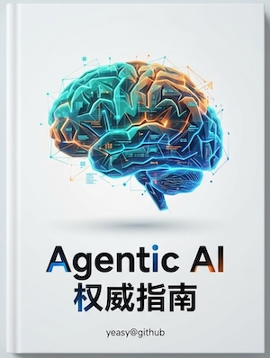

# 智能体 AI 权威指南

人工智能正在经历一场范式革命。当 ChatGPT 于 2022 年横空出世时，世界惊叹于大语言模型的涌现能力；而今天，我们站在一个更具历史意义的转折点——从"能对话的 AI"迈向"能行动的 AI"。智能体 AI (Agentic AI) 的崛起，标志着人工智能从被动响应走向主动规划、从单轮交互走向持续协作、从辅助工具走向自主伙伴。这不仅是技术演进，更是人机关系的根本重塑。

《智能体 AI 权威指南》正是为这一时代而生。本书将带你深入智能体技术的核心，从底层原理到架构设计，从主流框架到工程实践，构建完整的知识体系，助你把握这场变革的脉搏。

## 本书目标

本书致力于帮助研究人员、工程师、技术专家以及 AI 爱好者：
*   **理解核心概念**：深入剖析智能体 AI 的基本原理，包括感知、规划、记忆和行动。
*   **掌握架构模式**：学习 ReAct、Plan-and-Solve 等主流设计模式，以及多智能体协作（Multi-Agent）架构。
*   **熟悉主流框架**：详解 LangGraph, AutoGen, CrewAI 等前沿开发框架的特性与选型策略。
*   **落地最佳实践**：提供从设计、开发到评估、安全治理的全链路工程实践指南。

## 你将学到什么

通过阅读本书，你将建立起完整的智能体 AI 知识地图：
1.  **单体智能篇**：了解智能体的诞生原理，掌握其大脑（规划）、记忆与工具使用机制。
2.  **群体智能篇**：探索多智能体协作（Multi-Agent）、通信协议与社会模拟等高阶话题。
3.  **进化学习篇**：深入强化学习（RLHF）、评估体系与智能体自我进化能力。
4.  **工程实践篇**：实战 LangGraph, AutoGen 等主流框架，掌握 AgentOps 生产落地心法。
5.  **未来展望篇**：洞察安全伦理边界，展望通向 AGI 的技术路径。

## 读者对象

*   **想从 LLM 调用迈向智能体开发的工程师**：已经熟悉大模型 API，但不知如何让模型"动起来"、真正解决端到端任务。
*   **正在选型或落地智能体框架的技术负责人**：面对 LangGraph、AutoGen、CrewAI 等众多选项，需要深入理解各框架的设计哲学与适用场景。
*   **评估 AI 战略投资的企业高管**：需要理解智能体技术的商业价值、落地路径与风险边界，做出明智的资源配置决策。
*   **关注 AI 产品下一步演进方向的产品人**：希望理解智能体能力边界，为产品规划提供技术视角。
*   **对前沿 AI 技术保持好奇的研究者与大学生**：期望系统性理解智能体架构原理，而非碎片化的教程。

> **前置知识**：本书假设读者对 AI 和大语言模型有基本了解。如果你是 AI 领域的新手，建议先阅读 [《AI 入门指南》](https://github.com/yeasy/ai_beginner_guide) 建立基础概念。

让我们一起探索智能体的未来吧！

---

**下一节**: [第一章：智能体范式革命](01_paradigm/README.md)