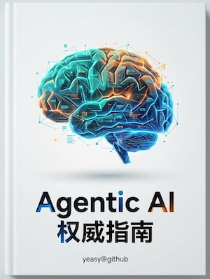
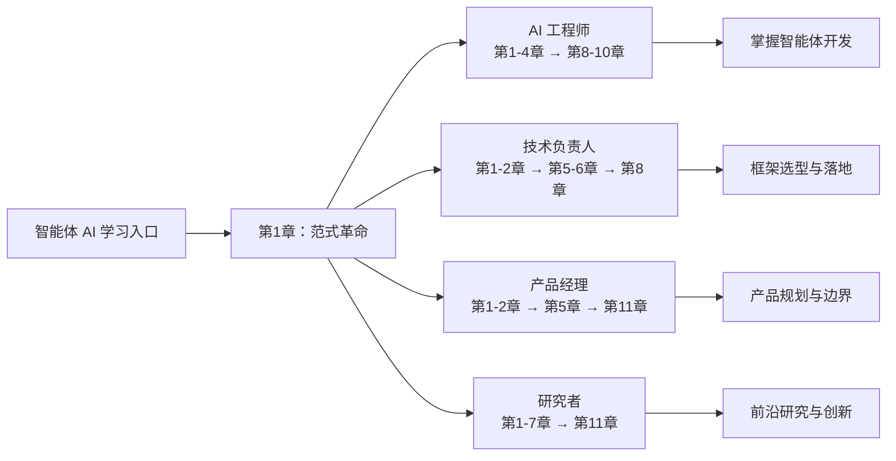

<div align="center">

# 智能体 AI 权威指南

[](https://creativecommons.org/licenses/by-nc-sa/4.0/)
[](https://github.com/yeasy/agentic_ai_guide)
[](https://github.com/yeasy/agentic_ai_guide/releases)
[](https://yeasy.gitbook.io/agentic_ai_guide)
[](https://github.com/yeasy/agentic_ai_guide/releases/latest)



</div>

人工智能正在经历一场范式革命。当对话式大模型广泛普及时，世界惊叹于它们的涌现能力；而今天，我们正站在一个更具历史意义的转折点——从“能对话的 AI”迈向“能行动的 AI”。智能体 AI（Agentic AI）的崛起，标志着人工智能从被动响应走向主动规划、从单轮交互走向持续协作、从辅助工具走向自主伙伴。这不仅是技术演进，更是人机关系的根本重塑。

《智能体 AI 权威指南》正是为这一时代而生。本书将带你深入智能体技术的核心，从底层原理到架构设计，从主流框架到工程实践，构建完整的知识体系，助你把握这场变革的脉搏。

## 本书目标

本书致力于帮助研究人员、工程师、技术专家以及 AI 爱好者：
* **理解核心概念**：深入剖析智能体 AI 的基本原理，包括感知、规划、记忆和行动。
* **掌握架构模式**：学习 ReAct、规划与执行等主流设计模式，以及多智能体协作架构。
* **熟悉开发框架与生态**：理解“链式编排”“图式编排”“数据驱动的 RAG 框架”“多智能体编排”等常见路线与选型思路。
* **落地最佳实践**：提供从设计、开发到评估、安全治理的全链路工程实践指南。

## 你将学到什么

通过阅读本书，你将建立起完整的智能体 AI 知识地图：
1. **单体智能篇**：了解智能体的诞生原理，掌握其大脑（规划）、记忆与工具使用机制。
2. **群体智能篇**：探索多智能体协作（Multi-Agent）、通信协议与社会模拟等高阶话题。
3. **进化学习篇**：深入强化学习（RLHF）、评估体系与智能体自我进化能力。
4. **工程实践篇**：以典型工程场景为主线，掌握 AgentOps 落地心法与 **Agentic Coding** 编程新范式。
5. **未来展望篇**：洞察安全伦理边界，展望通向 AGI 的技术路径。

## 读者对象

* **想从 LLM 调用迈向智能体开发的工程师**：已经熟悉大模型 API，但不知如何让模型“动起来”、真正解决端到端任务。
* **正在选型或落地智能体框架的技术负责人**：面对多种技术路线与产品形态，需要深入理解各类框架的设计哲学与适用场景。
* **评估 AI 战略投资的企业高管**：需要理解智能体技术的商业价值、落地路径与风险边界，做出明智的资源配置决策。
* **关注 AI 产品下一步演进方向的产品人**：希望理解智能体能力边界，为产品规划提供技术视角。
* **对前沿 AI 技术保持好奇的研究者与大学生**：期望系统性理解智能体架构原理，而非碎片化的教程。

> **前置知识**：本书假设读者对 AI 和大语言模型有基本了解。如果你是 AI 领域的新手，建议先阅读 [《零基础学 AI》](https://yeasy.gitbook.io/ai_beginner_guide) 建立基础概念。如果你希望先掌握提示词工程，推荐阅读 [《大模型提示词工程指南》](https://yeasy.gitbook.io/prompt_engineering_guide)。

开启智能体未来探索之旅！

## 学习路线图


```mermaid
graph LR
    Start[智能体 AI 学习入口] --> Ch1[第1章：范式革命]

    Ch1 --> Role1["AI 工程师<br/>第1-4章 → 第8-10章"]
    Ch1 --> Role2["技术负责人<br/>第1-2章 → 第5-6章 → 第8章"]
    Ch1 --> Role3["产品经理<br/>第1-2章 → 第5章 → 第11章"]
    Ch1 --> Role4["研究者<br/>第1-7章 → 第11章"]

    Role1 --> End1["掌握智能体开发"]
    Role2 --> End2["框架选型与落地"]
    Role3 --> End3["产品规划与边界"]
    Role4 --> End4["前沿研究与创新"]
```

| 读者角色 | 学习重点 | 核心成果 |
|---------|---------|---------|
| **AI 工程师** | 第1-4章 → 第8-10章 | 掌握智能体核心机制与 AgentOps 工程实践 |
| **技术负责人** | 第1-2章 → 第5-6章 → 第8章 | 理解多智能体协作架构，完成框架选型与落地 |
| **产品经理** | 第1-2章 → 第5章 → 第11章 | 理解智能体能力边界，为产品规划提供技术视角 |
| **研究者** | 第1-7章 → 第11章 | 系统掌握智能体架构原理与前沿研究方向 |

## 快速开始

### 在线阅读

👉 **推荐**：[GitBook 在线版](https://yeasy.gitbook.io/agentic_ai_guide/)

## 下载离线版本

本书提供 PDF 版本供离线阅读，可前往 [GitHub Releases](https://github.com/yeasy/agentic_ai_guide/releases/latest) 页面下载最新版本。

如需获取默认分支自动更新的预览版，可直接下载 [agentic_ai_guide.pdf](https://github.com/yeasy/agentic_ai_guide/releases/download/preview-pdf/agentic_ai_guide.pdf)。该文件会随主线更新覆盖，不代表正式发布版本。

### 本地阅读

先安装 [mdPress](https://github.com/yeasy/mdpress)：

```bash
brew tap yeasy/tap && brew install mdpress
mdpress serve
```

启动后访问 [本地阅读地址](http://localhost:4000) 即可阅读。

---

## 推荐阅读

本书是 AI 技术丛书的一部分。以下书籍与本书形成互补，建议根据需要组合阅读：

| 书名 | 与本书的关系 |
|------|------------|
| [《零基础学 AI》](https://yeasy.gitbook.io/ai_beginner_guide) | 前置入门读物，帮助建立 AI 基础概念 |
| [《大模型提示词工程指南》](https://yeasy.gitbook.io/prompt_engineering_guide) | 智能体提示词设计的理论基础 |
| [《大模型上下文工程权威指南》](https://yeasy.gitbook.io/context_engineering_guide) | 深入理解智能体的上下文管理与记忆架构 |
| [《Claude 技术指南》](https://yeasy.gitbook.io/claude_guide) | 掌握 Claude 工具使用、MCP 协议与 Agentic Coding |
| [《大模型安全权威指南》](https://yeasy.gitbook.io/ai_security_guide) | 智能体系统的安全设计与攻防实践 |
| [《OpenClaw 从入门到精通》](https://yeasy.gitbook.io/openclaw_guide) | 开源自驱型智能体框架的落地实战与原理剖析 |
| [《大模型原理与架构》](https://yeasy.gitbook.io/llm_internals) | 深入理解大语言模型底层逻辑与架构 |

---

## 参与贡献

欢迎贡献！您可以通过以下方式参与：

- 🐛 [提交 Issue](https://github.com/yeasy/agentic_ai_guide/issues) — 报告错误或提出建议
- 📝 [提交 PR](https://github.com/yeasy/agentic_ai_guide/pulls) — 改进内容或修复 typo
- ⭐ Star 本项目 — 帮助更多人发现这本书

---

## 许可证

本书采用 [CC BY-NC-SA 4.0](https://creativecommons.org/licenses/by-nc-sa/4.0/) 许可证。

您可以自由分享和演绎，但需署名、非商业使用、相同方式共享。
